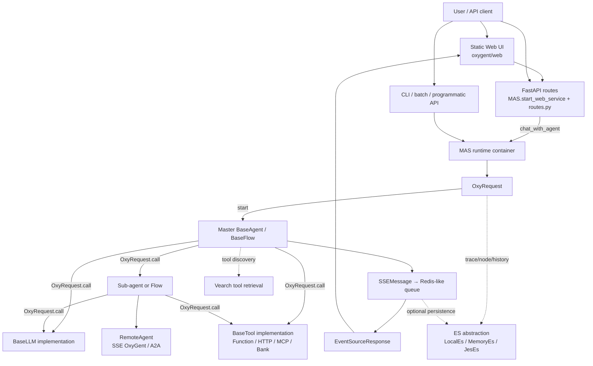
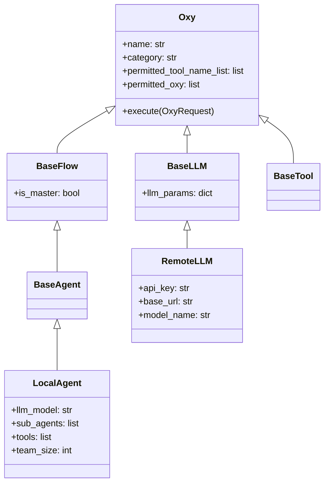

# OxyGent 当前架构审计

## 1. 审计范围与结论

本审计以当前仓库代码为准，覆盖 `oxygent/`、`applications/`、`examples/`、`tests/`、根目录配置和 CI。当前 OxyGent 的核心不是传统的分层 Web 应用，而是一个以 `MAS` 为运行容器、以字符串名称为寻址方式、以 `Oxy.execute()` 为统一生命周期的异步调用框架。

其主要优点是 Agent、LLM、Tool、Flow 都能进入同一个注册表并通过同一种请求信封调用；主要限制是运行时注册、业务编排、Web 服务、SSE、存储初始化和管理 API 大量集中在 `MAS`，且模型、Provider、凭证和实例路由尚未分层。

## 2. 当前真实架构图

图中的 `Master Agent` 不是独立类型。`MAS.init_master_agent_name()` 从注册的 `BaseFlow`/`BaseAgent` 中选择第一个，或优先选择 `is_master=True` 的实例。

## 3. 初始化与运行入口

核心入口是 `oxygent/mas.py::MAS`：

1. `MAS.__aenter__()` 调用 `init()`，并把实例写入 `oxygent.routes` 的全局 MAS 引用。
2. `MAS.init()` 注册 `oxy_space`，按配置增加 `retrieve_tools`，初始化数据库，初始化全部 Oxy，确定主 Agent，创建 Vearch 表，构建组织树，最后注册动态 Prompt Agent。
3. `MAS.init_all_oxy()` 先初始化 `BaseLLM`、`BaseTool`，再初始化 `BaseFlow`、`BaseAgent`。工具可并发初始化。
4. `MAS.__aexit__()` 等待后台存储任务，然后关闭 Prompt Manager、ES、Redis 和全部 Oxy。

对外运行方式如下：

| 方式 | 真实入口 | 特征 |
| --- | --- | --- |
| Web | `MAS.start_web_service()` | 在方法内部构造 FastAPI/路由/静态目录并运行 Uvicorn |
| CLI | `MAS.start_cli_mode()` | 用 `from_trace_id` 串联多轮会话 |
| 批处理 | `MAS.start_batch_processing()` | 对查询列表创建任务并 `asyncio.gather()` |
| 高级程序调用 | `MAS.chat_with_agent()` | 构造完整 `OxyRequest`，支持历史继承、重启和消息流 |
| 直接程序调用 | `MAS.call()` | 直接执行命名 Oxy，并返回 `oxy_response.output` |
| 远程协作 | `SSEOxyGent`、`A2AClientAgent` | 把远端 Agent 作为本地 `RemoteAgent` 注册 |

## 4. 核心抽象关系

- `Oxy` 提供统一的并发限制、输入输出 Hook、重试、超时外围配合、Trace/Node 存储和事件发送生命周期。
- `BaseAgent` 增加顶层 Trace 与 History 存储。
- `LocalAgent` 增加模型绑定、Prompt、子 Agent、工具、短期记忆和工具检索。
- `BaseFlow` 也是 `category="agent"`，可作为主入口和权限主体。
- `BaseTool` 统一函数、HTTP、MCP、Bank 等工具。
- `BaseLLM` 统一消息预处理、流式事件、Token Usage 和 Provider 参数合并。

## 5. 当前注册和发现机制

`MAS.oxy_name_to_oxy: dict[str, Oxy]` 是全局运行时注册表，Agent、Flow、LLM、Tool 共用同一名称空间。`MAS.add_oxy()` 强制名称唯一。调用者通过 `OxyRequest.get_oxy()`/`has_oxy()` 查询，`LocalAgent.init()` 还会校验 `llm_model`、子 Agent 和工具名称。

`OxyFactory` 是另一套静态类名到类的映射，仅允许显式列出的类型，并阻止一组可执行代码或网络访问的危险类从外部创建。运行时管理工具 `preset_tools/oxy_manage_tools.py` 又维护了 Agent 类型映射。这些并行映射是后续 Registry 收敛点。

## 6. 当前不具备的产品域

核心包中没有 Project、Role、Provider Registry、Model Registry、Role Model Policy、Workflow Engine、Task Graph、Artifact、Approval 或 Code Workspace 的领域实体。现有 `Workflow`/`PlanAndSolve` 是运行时编排实现，不是持久化、可恢复、带依赖关系和审批状态的任务图。

## 7. 建议保持的兼容边界

第一阶段应保持以下协议不变：

- `Oxy.execute(OxyRequest) -> OxyResponse` 生命周期；
- `OxyRequest.call(callee=..., arguments=...)` 的名称调用方式；
- `MAS(oxy_space=[...])` 注册方式；
- `chat_with_agent()`、CLI、批处理和 Web 入口；
- `tool_call`、`observation`、`think`、`stream`、`stream_end`、`answer` 和 SSE `close` 事件；
- LocalEs/MemoryEs/JES、LocalRedis/Redis、Vearch 的现有可选降级路径。
