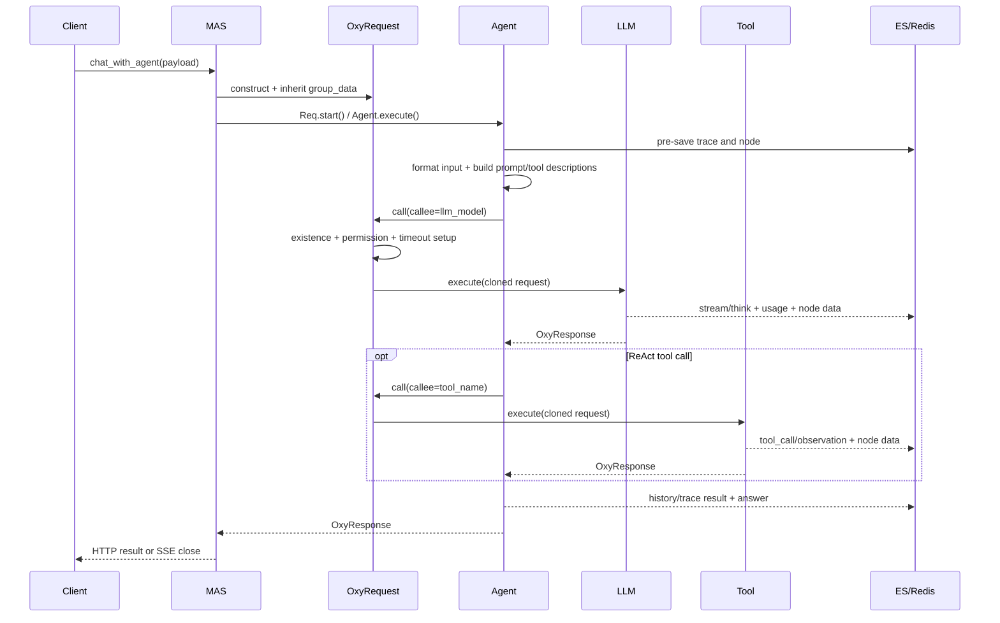

# Agent 调用与协作流程

## 1. 顶层调用

Web、CLI 和批处理最终都进入 `MAS.chat_with_agent()`。该方法会：

1. 对重启请求从 `{app}_node` 和 `{app}_trace` 恢复原始 payload；
2. 初始化 `shared_data._metrics` 和查询开始时间；
3. 把 `OxyRequest` 已知字段写到请求对象，其余字段写入 `arguments`；
4. 根据 `from_trace_id` 等待上一 Trace 的异步存储完成，并继承 `group_id/group_data`；
5. 缺省时把 `callee` 设为 `master_agent_name`；
6. 调用 `OxyRequest.start()`，即直接执行当前 callee；
7. SSE 模式下发送 `event="close"`。

`MAS.call()` 是更轻量的直接入口：它构造 `OxyRequest` 后直接调用目标 `execute()`，不经过 `OxyRequest.call()` 的子调用权限检查，并实际返回 `output` 而非注解声明的 `OxyResponse`。

## 2. 单次 Agent 调用序列

## 3. `Oxy.execute()` 生命周期

所有 Agent、Flow、LLM 和 Tool 共用以下生命周期：

- `_pre_process()` 更新 caller/callee 分类、调用栈和节点栈；
- 计算基于可序列化参数的 `input_md5`；
- `_request_interceptor()` 支持基于参考 Trace 的节点重放；
- 异步写入运行中 Node；
- `_format_input()`、`_pre_send_message()`；
- `_before_execute()` 并行执行 `preceding_oxy`；
- `func_interceptor`、`func_execute` 或 `_execute()`；
- 按 `retries` 和 `delay` 重试；
- `_after_execute()`、`_post_process()`；
- 异步或同步写回 Node；
- `_format_output()` 和 `_post_send_message()`。

外层子调用由 `OxyRequest.call()` 使用 `asyncio.wait_for(..., timeout=oxy.timeout)` 控制超时。重试在目标 `Oxy.execute()` 内部实现，因此一次子调用最多经历一次总体超时和多次内部执行尝试。

## 4. Agent 与模型绑定

当前是“Agent 实例到 LLM Oxy 名称”的一对一静态绑定：

- `LocalAgent.llm_model` 是字符串字段，默认 `Config.agent.llm_model`；
- `ChatAgent`、`ReActAgent`、`ParallelAgent`、`PlanAndSolveAgent`、`ShellUseAgent` 直接以 `callee=self.llm_model` 调用；
- `PlanAndSolve` Flow 自己声明了 `llm_model` 作为最终摘要模型；
- `PromptOptimizer` 也按注册名称自动选择或接收一个 LLM。

一个 LLM 可被多个 Agent 共享，但一次 Agent 调用没有主选/备用列表、动态策略、能力约束、租户/项目策略或调用级故障切换。`llm_model` 实际指向一个已经携带 Provider URL、API Key 和模型名的 LLM 实例。

## 5. 子 Agent 注册与调用

`LocalAgent.sub_agents` 接收已注册 Oxy 的名称。`LocalAgent._init_available_tool_name_list()` 校验名称后，将子 Agent 加入 `permitted_tool_name_list`。对 ReAct Agent 而言，子 Agent 与普通 Tool 一样以描述文本暴露给模型，再由模型输出 `tool_name/arguments` 触发 `OxyRequest.call()`。

`MAS.init_agent_organization()` 从主 Agent 开始，递归遍历 `permitted_tool_name_list + permitted_oxy` 生成组织树。远程 Agent 可返回自己的组织结构。

## 6. 并行能力

当前支持多种局部并行：

- `ParallelAgent` 和 `ParallelFlow` 对许可列表执行 `asyncio.gather()`；
- `ReActAgent` 对解析出的多个工具调用执行 `asyncio.gather()`；
- `Oxy.preceding_oxy` 在执行主体前并行运行；
- `LocalAgent.team_size > 1` 会复制 Agent 实例，并用同名 `ParallelAgent` 替换原注册项；
- `MAS.start_batch_processing()` 并发处理多个顶层查询；
- 每个 Oxy 自身有 `asyncio.Semaphore`。

这些是即时协程并行，不是可持久化 Task DAG；失败策略主要由 `gather()` 和各节点 `OxyResponse.state` 决定，没有统一的依赖状态机、补偿或恢复策略。

## 7. 上下文传递

`OxyRequest.clone_with()` 深拷贝请求大部分字段，但有意共享：

- `mas`：同一个运行容器；
- `shared_data`：同一 Trace 树共享；
- `group_data`：同一会话组共享。

调用栈、节点栈和 arguments 被复制；`parallel_id/latest_node_ids` 有特殊重置和协调逻辑。短期记忆从 `{app}_history` 读取，按 `session_name` 和 Trace 根筛选。ReAct 的当前轮次记忆只存在于本次执行的 `Memory` 对象中，并作为 Node extra 保存。

## 8. 共享可变状态风险

- 并行子调用共享 `shared_data` 和 `group_data`，没有键级锁、事务或不可变快照；同时写同一键可能产生竞态。
- `OxyRequest.call()` 会更新原请求的 `parallel_dict` 和 `latest_node_ids`；并行调度依赖事件循环时序。
- `LocalAgent.init()` 会修改 `sub_agents`、权限列表和输入 schema；`team_size` 还会原地替换 MAS 注册项。
- `MAS.global_data`、`active_tasks`、`event_dict`、`feedback_dict`、`channel_id_dict` 都是进程内共享状态，多 worker 时不共享。
- `Config._config` 是进程级可变单例，测试通过 fixture 手工保存和恢复。

目标架构应把 Project/Workflow/Task/Artifact 状态移出这些临时字典，同时保留 `shared_data/group_data` 作为兼容的执行期上下文。
