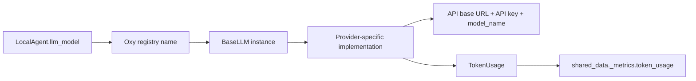

# LLM 与 Provider 调用链

## 1. 当前 LLM 注册方式

LLM 与 Agent/Tool 一样作为命名 Oxy 实例放入 `MAS.oxy_name_to_oxy`。`MAS.init_all_oxy()` 先初始化所有 `BaseLLM`。Agent 的 `llm_model` 只是这个注册名称，不是独立 Model ID。

## 2. 直接持有模型名称的类

| 类/模块 | 字段或行为 | 说明 |
| --- | --- | --- |
| `LocalAgent` | `llm_model: str` | Chat/ReAct/Parallel 等本地 Agent 继承并直接调用 |
| `PlanAndSolve` | `llm_model: str` | 计划执行耗尽后的最终摘要 |
| `RemoteLLM` | `model_name` | 远端 Provider 请求中的真实模型 ID |
| `LiteLLM` | `model_name` | 前缀同时参与 LiteLLM Provider 路由 |
| `LocalLLM` | `model_path` | 本地 Transformers 模型路径 |
| `PromptOptimizer` | `llm_model` 构造参数 | 从 MAS 已注册 LLM 中选择优化器模型 |
| `oxy_manage_tools.create_agent` | `llm_model` 参数 | 运行时创建 Agent 时指定已注册 LLM 名称 |

因此当前至少有两层“模型名”：Agent 使用的 Oxy 注册名，以及 LLM Provider 请求使用的 `model_name`。两者没有显式类型区分。

## 3. LLM 实现清单

| 实现 | 构造/发现方式 | 调用协议 |
| --- | --- | --- |
| `HttpLLM(RemoteLLM)` | 根据 URL 与 `api_key` 分支 | Gemini native、OpenAI-compatible 或 Ollama |
| `OpenAILLM(RemoteLLM)` | `AsyncOpenAI(api_key, base_url)` | `chat.completions.create` |
| `ResponsesLLM(RemoteLLM)` | 明确使用传入的完整 URL | OpenAI Responses 风格 JSON |
| `LiteLLM(BaseLLM)` | LiteLLM 依据 `model_name` 前缀路由 | `litellm.acompletion` |
| `LocalLLM(BaseLLM)` | `model_path` 加载 Transformers | 本地 tokenizer/model generate |
| `ActorLLM(BaseLLM)` | Ray actor | 远程 actor 生成 |
| `MockLLM(BaseLLM)` | 注入 mock 函数 | 测试与离线验证 |

`OxyFactory` 目前显式映射 `HttpLLM`、`OpenAILLM`、`LiteLLM` 和 `ResponsesLLM`，但不是通用插件发现机制。

## 4. URL/模型名决定 Provider 的代码

`HttpLLM._execute()` 中存在硬编码分支：

- URL 包含 `generativelanguage.googleapis.com`：判定为 Gemini，并拼接 `/models/{model_name}:generateContent`；
- 非 Gemini 且 `api_key is not None`：判定为 OpenAI-compatible，并拼接 `/chat/completions`；
- 否则：判定为 Ollama，并拼接 `/api/chat`。

这意味着“未配置 API Key”被用作 Provider 类型信号，空字符串和 `None` 的行为也可能不同。新网关若不符合这三种路径，需新增 LLM 子类或绕过 `HttpLLM`。

`LiteLLM` 明确依赖 `model_name` 前缀，例如 `anthropic/...`、`openai/...`、`bedrock/...`。这是外部库的路由约定，但当前系统没有把这种 Provider 判定结果注册为自身领域数据。

## 5. 调用链与参数合并

1. Agent 构造 `messages`，通过 `OxyRequest.call(callee=self.llm_model)` 调用。
2. `BaseLLM._get_messages()` 处理 system prompt 禁用、多模态内容、文件读取和可选 base64 转换。
3. Provider 子类构造基础 payload。
4. `BaseLLM._build_payload()` 依次合并全局 `Config.llm`、实例 `llm_params` 和本次请求参数；后写入值覆盖前者，`messages` 被排除在通用合并之外。
5. Provider 发起请求并解析流式或非流式响应。
6. 流式实现发送 `stream`/`stream_end`，`BaseLLM` 还可发送 `think`。
7. 生成 `TokenUsage` 并在 `_after_execute()` 汇总。

## 6. Token Usage

`oxygent/utils/token_utils.py::build_token_usage()` 统一解析 OpenAI、Gemini、Anthropic、DeepSeek/GLM 等常见字段。若 Provider 不返回 usage，则由 `TokenEstimator` 使用 tiktoken；不可用时按字符数近似。

`BaseLLM._after_execute()` 调用 `aggregate_token_usage()`，将每次调用累加到共享的 `OxyRequest.shared_data["_metrics"]["token_usage"]`，并按 `model_name` 分组。单节点 Usage 同时放入 `OxyResponse.extra["usage"]`，随后进入 Node 存储。

当前统计缺少：Provider 实例、凭证别名、角色、项目、价格、延迟、重试次数、失败类别、路由选择原因和 fallback 链。

## 7. 错误、重试与超时

| 层 | 真实机制 |
| --- | --- |
| Provider HTTP | `httpx`/SDK 抛异常；部分实现 `raise_for_status()` |
| Oxy 执行 | `Oxy.execute()` 按 `retries` 和 `delay` 重试 `_execute()` |
| 子调用总超时 | `OxyRequest.call()` 用目标 Oxy 的 `timeout` 包裹 `execute()` |
| SSE 远程 Agent | `SSEOxyGent` 自带指数退避和服务端 `retry` 支持 |
| A2A | Client 自带 HTTP timeout，并对未完成任务轮询 |
| 用户展示 | `friendly_error_text` 可覆盖失败输出 |

目前没有跨 LLM 实例的 fallback。一个 LLM 实例重试耗尽后返回 `FAILED`，Agent 通常只获得错误文本，不会自动切换备用模型。

## 8. 目标兼容接口

建议新增 `ModelRouter` 作为一个普通 `BaseLLM` Adapter，例如注册名 `role_model_router`。Agent 仍调用其 `llm_model` 字符串；Router 内部根据 `ExecutionContext(project_id, role_id, agent_id)` 查询 Policy，选择 Model 与 Provider，再调用既有 LLM Adapter。这样可先实现解耦和回退，而无需修改 Chat/ReAct 核心循环。

凭证只保存引用（`credential_ref`），由运行时 Secret Resolver 解析；任何 Trace、配置 API、日志和 Artifact 都不得保存明文 Key。
