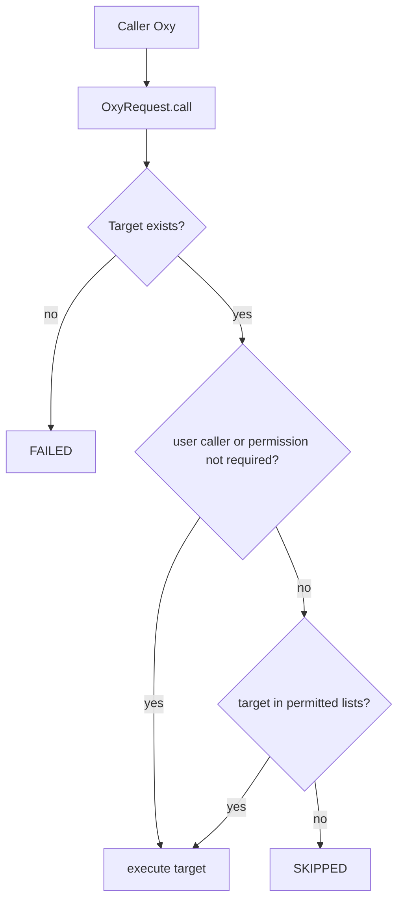

# Tool 与权限系统

## 1. 当前权限模型

`Oxy` 定义两个许可列表：`permitted_tool_name_list` 和 `permitted_oxy`。`BaseAgent`、`BaseFlow`、`BaseTool` 默认 `is_permission_required=True`；LLM 默认继承 `Oxy.is_permission_required=False`，所以模型通常不需要显式加入 Agent 工具列表。

子调用统一在 `OxyRequest.call()` 检查：当 caller 不是 user、目标要求权限且目标名称不在调用者两个许可列表中时，返回 `OxyState.SKIPPED`。顶层 user 调用不受该检查限制，`MAS.call()` 也直接执行目标 Oxy。

这是名称级 allow-list，不包含参数约束、资源范围、动作风险、项目边界、角色、审批条件或凭证作用域。

## 2. 工具注册

`LocalAgent._init_available_tool_name_list()` 根据配置扩展许可：

- `sub_agents`：直接加入许可；
- `MCPTool`/`FunctionTool`：加入工具名；
- `BaseMCPClient`：展开其 `included_tool_name_list`；
- `FunctionHub`：展开 `func_dict` 中的函数工具；
- `BankTool`/`BankClient`：加入或展开 Bank；
- `except_tools`：仅在初始化展开时过滤。

工具和子 Agent 最终都通过字符串名称进入相同调用路径。Vearch 启用时，`retrieve_tools` 仅缩小暴露给 LLM 的描述集合；真正执行仍由权限列表校验。

## 3. 工具类型

| 类型 | 实现 | 生命周期/风险特征 |
| --- | --- | --- |
| Python 函数 | `FunctionHub` → `FunctionTool` | 反射函数签名并注入请求参数 |
| HTTP | `HttpTool` | 对外网络调用 |
| MCP | `StdioMCPClient`、`SSEMCPClient`、`StreamableMCPClient` → `MCPTool` | 工具发现、远程或子进程执行 |
| Bank | `BankClient`、`BankTool`、`BankRouter` | 将远端/路由能力包装为工具 |
| 预置工具 | `oxygent/preset_tools` | 文件、Shell、Python、SSH、HTTP、系统等高风险能力 |

MCP Client 初始化时会把发现到的工具注册进 MAS 全局名称空间。Stdio MCP 会继承当前进程环境，并可启动配置指定的命令。

## 4. 现有安全控制

- `OxyFactory` 使用显式类映射，并阻止外部创建可执行代码或网络访问的危险类；
- `OxyRequest.call()` 做名称级 allow-list；
- 文件工具尝试限制到启动时的 `os.getcwd()`；
- 上传后的静态文件响应增加 attachment、nosniff 和严格 CSP；
- SSE/A2A 转发会过滤部分不安全 Header；
- 默认 SSE 的 `tool_call` 只发送 query，除非打开完整参数配置。

## 5. 主要缺口

1. Web 管理、上传、脚本保存、运行时 `/call`、Prompt 修改和调试接口没有统一身份认证/授权依赖。
2. 顶层 user 可指定 callee；`MAS.call()` 也绕过子调用权限检查，因此“内部 Agent 权限”和“外部 API 权限”不是同一个边界。
3. `shell_tools` 使用 shell 执行；`python_tools` 使用 `exec()`；SSH 工具直接发送命令。它们只应在明确的工作区和审批策略下暴露。
4. 文件工具用字符串 `startswith(allowed_dir)` 判断路径，目录前缀相同可能绕过；应使用解析后的 `Path.is_relative_to()` 或等价安全检查。
5. Stdio MCP 继承整个 `os.environ`，可能把无关凭证传给子进程。
6. `FunctionTool` 异常日志包含完整 arguments，可能泄露输入、Token 或业务数据。
7. 权限是实例上的可变列表，运行时管理工具可以改 Agent 和父子关系，但没有审计审批模型。

## 6. 目标权限模型

建议保留现有名称 allow-list 作为执行期最后一道兼容检查，并在其前增加：

- `ToolCapability`：工具支持的动作和风险级别；
- `RoleToolPolicy`：角色允许的能力、参数约束和资源范围；
- `ProjectPolicy`：项目工作区、网络域、仓库和数据边界；
- `ApprovalPolicy`：需要人工确认的动作；
- `ExecutionGrant`：一次任务解析出的不可变授权快照；
- `AuditEvent`：谁、以何角色、为何任务批准或执行了什么。

首期不修改 `OxyRequest.call()` 的语义，只在调用前由 Adapter 生成/校验 Grant，并将拒绝映射为现有 `SKIPPED`。
