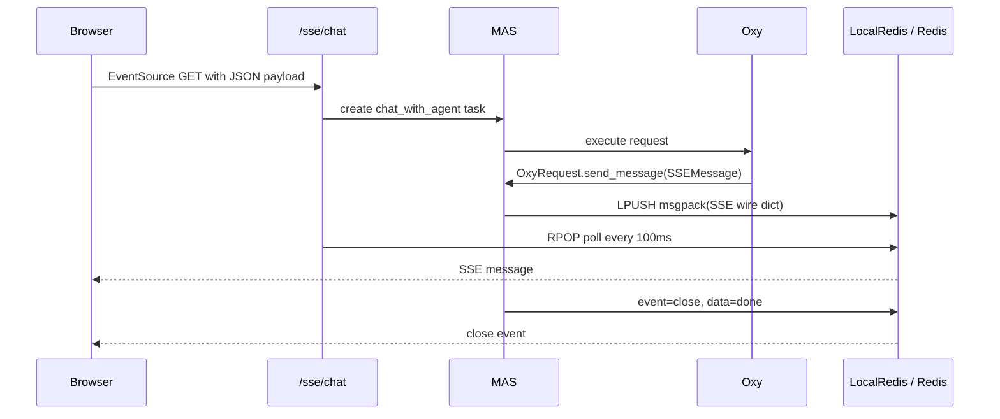

# Web 与事件协议

## 1. Web 服务组成

`MAS.start_web_service()` 在方法内部创建 FastAPI App、挂载 `oxygent.routes.router`、用户 Router、中间件和静态目录，然后直接创建 `uvicorn.Server`。因此 App Factory、运行时容器和服务器生命周期目前耦合在一起。

静态 UI 位于 `oxygent/web/`，主要是 HTML、原生 JavaScript、jQuery/静态库和 CSS，没有独立前端构建工程。Chat 主界面的大量状态和行为直接写在 `index.html`；Prompt 管理使用 `js/prompt-manager.js` 的模块级 `state`；组织树、消息、时间线和上传分别在独立脚本中。

## 2. 路由清单

`MAS.start_web_service()` 内定义：

- `/get_organization`、`/get_first_query`、`/get_welcome_message`、`/get_description`、`/get_agents`；
- `/chat`：同步 JSON 响应；
- `/sse/chat`：执行任务并返回 SSE；
- `/async/chat`：后台执行；
- `/async/trace`：稍后订阅指定 Trace 的 SSE；
- `/feedback`：向进程内 Queue 写入人工反馈；
- `/list_banks`：存在 BankRouter 时提供。

`oxygent/routes.py` 还定义：

- 基础健康、上传、Node/Trace 查看与运行时 `/call`；
- 脚本列表、保存、加载；
- Prompt CRUD、搜索、历史、版本回滚和优化；
- Agent 列表；
- Rating CRUD、统计、历史与调试接口。

没有 FastAPI WebSocket endpoint。`index.html` 中仍有 `ws` 变量及 unload 时的 `WebSocket.OPEN` 检查，属于遗留前端状态，不代表后端提供 WebSocket 协议。

## 3. SSE 数据路径

远程 `SSEOxyGent` 反向扮演 SSE Client，调用另一个 OxyGent 的 `/sse/chat`，转发事件并做重连。A2A 则由 SDK 处理消息、流和任务轮询。

## 4. 事件类型与负载

| 事件/消息 | 产生位置 | 主要内容 |
| --- | --- | --- |
| `tool_call` | `Oxy._pre_send_message()` | node/caller/callee/call_stack/arguments |
| `observation` | `Oxy._post_send_message()` | 节点元数据和 output |
| `answer` | `Oxy._post_send_message()` | 顶层最终输出 |
| `think` | `BaseLLM._post_send_message()` | 从 `<think>` 或 JSON 提取的思考文本 |
| `stream` | 流式 LLM | delta、agent、node_id |
| `stream_end` | 流式 LLM | 某节点流结束 |
| SSE `close` | `MAS.chat_with_agent()` | 整个 Trace 完成 |
| feedback 相关消息 | Tool/应用 Hook | `channel_id` 关联进程内 Queue |

`SSEMessage` 的 wire 字段是 `id/event/data/retry`，其中 data 会 JSON 序列化；进 Redis 前整个 SSE dict 再由 msgpack 编码。

## 5. 前端状态

Chat UI 维护 `from_trace_id`、分支、帧、节点、当前 EventSource、工具路径等大量全局变量。请求以 GET EventSource 的 query 参数携带 JSON payload。页面支持分支/重启、组织图、Trace 播放、附件和 Rating。

本地持久状态很少：`sessionStorage.page_refreshed` 用于刷新控制，`localStorage.flowchart_show_master` 保存组织图偏好。会话主状态主要在页面内存和后端 Trace 中。Prompt 页面独立调用 `/api/prompts/*`。

## 6. 协议与安全风险

- 默认 CORS 是 `allow_origins=["*"]` 且 `allow_credentials=True`；部署时应收窄来源。
- 核心 Router 未见统一认证依赖；Prompt、脚本、上传、调试和 Rating 管理面默认可访问。
- `request_to_payload()` 记录完整 payload，并把全部请求 Header 放入 `shared_data._headers`；需增加脱敏和 allow-list。
- EventSource 使用 GET 携带 JSON，内容可能进入代理、浏览器历史和访问日志；敏感请求应使用 POST SSE 客户端或一次性请求 ID。
- SSE 队列在 LocalRedis 模式下仅进程内有效；`workers > 1` 时生产者和消费者可能不在同一进程。
- EventSource 断开会取消 active task，但异步存储与外部 Provider 的取消传播需要逐实现验证。
- 事件没有显式 schema version，未来 UI 扩展必须先增加版本和向后兼容策略。

## 7. 演进建议

先抽取无行为变化的 `create_app(mas)` 和版本化事件 DTO；保留现有路径与 payload。后续新增 `/api/v1/projects`、`/api/v1/workflows` 时与旧 Chat API 并存，Web UI 最后再按 Chat/Projects/Code Workspace 分区。
