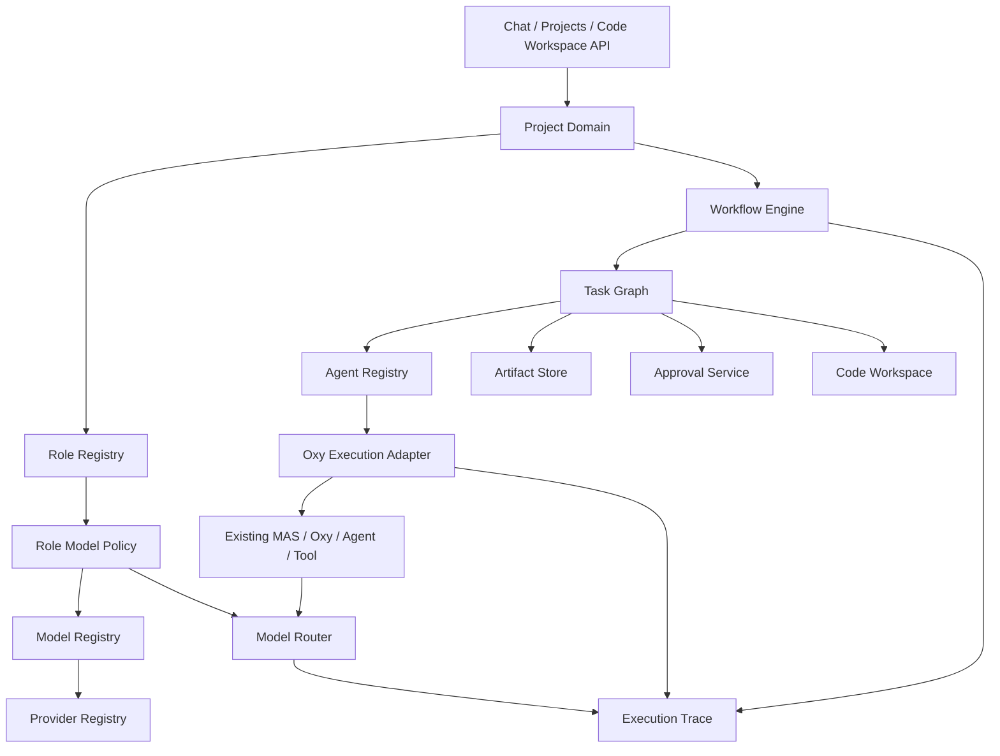
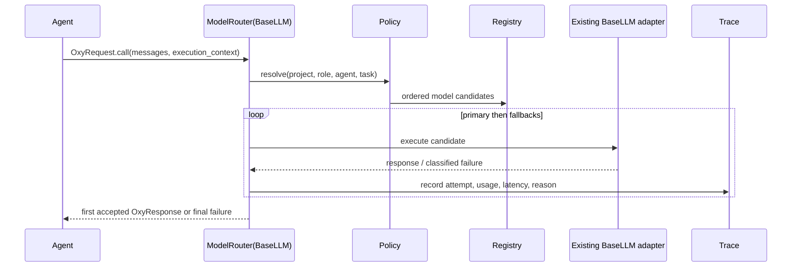

# 目标架构设计

## 1. 设计原则

- 保留 Oxy 作为执行适配层，不把 Project/Role/Workflow 逻辑塞入 Oxy 子类层级。
- Agent 定义、Role、模型策略和运行实例使用不同 ID 与生命周期。
- 先用 Adapter 接入现有 MAS，再逐步抽取服务；现有 Chat/CLI/批处理/MCP/SSE 保持可用。
- 所有持久化领域对象带 `project_id`、版本和审计字段。
- Router 的每次选择与 fallback 都进入 Execution Trace。
- Workflow/Task/Artifact 是事实来源，`shared_data` 只作为兼容执行上下文。

## 2. 目标组件

| 组件 | 职责 | 与现有代码关系 |
| --- | --- | --- |
| Project Domain | 项目、成员、仓库、策略、生命周期 | 新增领域层 |
| Role Registry | PM/Architect/Lead/Engineer/Reviewer/QA 等可配置角色 | 新增；不硬编码演示业务 |
| Agent Registry | Agent 定义、版本、Prompt、工具能力 | 包装 MAS/Oxy 注册信息 |
| Provider Registry | Provider 协议、endpoint、能力、Secret 引用 | 包装现有 LLM 实现 |
| Model Registry | 模型 ID、Provider、能力、上下文窗口、成本元数据 | 与 Provider 分离 |
| Role Model Policy | 角色到主选/备用模型及约束 | 新增策略对象 |
| Model Router | 选择、重试、熔断、fallback 和统计 | 首先实现为 `BaseLLM` Adapter |
| Workflow Engine | Workflow 定义、运行状态、恢复 | 复用 Oxy 调用作为执行器 |
| Task Graph | Task DAG、依赖、状态、重试、负责人角色 | 新增持久化模型 |
| Artifact Store | 需求、方案、计划、代码 Diff、测试报告、Review | 新增 Repository |
| Approval Service | 风险动作与阶段门禁 | 适配现有 feedback，持久化决策 |
| Execution Trace | 统一 Agent/Tool/Model/Workflow 调用记录 | 兼容并投影现有 Trace/Node |
| Code Workspace | 仓库、分支、文件、Diff、命令和测试边界 | 后期新增，不引入外部代码 Agent |

## 3. 目标关系图

## 4. 核心领域对象建议

以下是设计契约，不要求本阶段立即编码：

- `Project(id, name, status, workspace_policy, repository_refs, created_by)`；
- `RoleDefinition(id, name, responsibilities, artifact_contracts, tool_policy_id)`；
- `AgentDefinition(id, agent_type, prompt_ref, tool_capability_refs, version)`；
- `AgentInstance(id, project_id, role_id, agent_definition_id, runtime_state)`；
- `Provider(id, protocol, endpoint_ref, credential_ref, limits, health_policy)`；
- `Model(id, provider_id, provider_model_name, capabilities, limits, pricing_ref)`；
- `RoleModelPolicy(role_id, primary_model_id, fallback_model_ids, constraints)`；
- `WorkflowDefinition/WorkflowRun`；
- `Task(id, workflow_run_id, role_id, dependencies, state, input_artifact_refs, output_contract)`；
- `Artifact(id, project_id, type, version, content_ref, producer_task_id, review_state)`；
- `Approval(id, task_id, action, requested_by, decided_by, state, reason)`；
- `ModelInvocation` 和 `ExecutionEvent`。

Role 名称是数据，不写入 Python 枚举，因此未来可增加自定义角色。系统可提供 PM、Architect、Lead、Engineer、Reviewer、QA 模板，但领域模型不依赖这些固定值。

## 5. 模型路由

Router 必须仍通过 Oxy 生命周期执行，使 Node、SSE、Token 和重试保持可见。初期可以让 Router 内部调用已注册 LLM Oxy；需避免普通权限校验误阻止内部候选调用，并防止递归指向自身。

故障切换只对可重试错误发生，例如连接、限流、Provider 5xx、超时；认证失败、请求无效、内容策略拒绝和预算不足应按策略明确处理，不能盲目换模型。

## 6. Artifact 驱动协作

角色之间不直接依赖彼此的临时 Prompt 文本，而通过版本化 Artifact 交接：需求、架构决策、任务计划、实现说明、Diff、测试结果、Review 和批准记录。Task 声明输入 Artifact 类型与输出契约；Workflow Engine 在依赖完成且审批满足后调度 Agent。

现有 Agent 仍可作为 Task executor，Artifact 摘要或引用通过 `OxyRequest.arguments` 注入。大内容不复制进 `shared_data`，只传 Artifact ref。

## 7. Code Workspace 边界

Code Workspace 后期提供：仓库绑定、工作树、分支、受限文件访问、Diff、命令执行、测试结果和审批。它以 Tool/Artifact Adapter 暴露给现有 Agent；默认只读，写文件、执行命令、网络访问、Git 提交/推送分别授权。平台不引入 Aider、OpenHands 等外部代码 Agent。

## 8. 部署形态

本地模式继续支持 LocalEs、LocalRedis 和单进程 Uvicorn。生产模式明确要求共享 ES/Redis、Secret Provider、认证、审计与后台 Worker。领域服务先作为同一 Python 进程内模块实现，不立即拆微服务，也不引入不必要的新框架。
