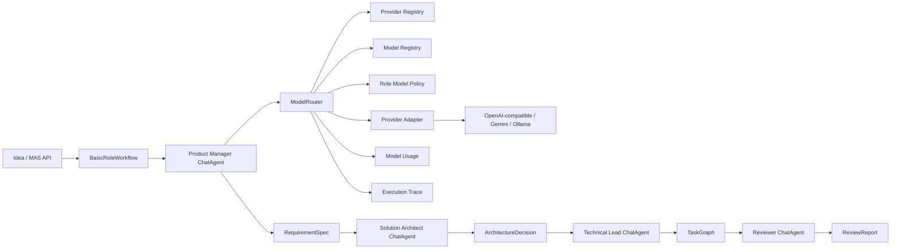

# Phase 1: multi-role, multi-model platform implementation

## Scope and compatibility

This phase adds a platform layer under `oxygent/platform/`. It does not replace
`MAS`, `Oxy`, `ReActAgent`, Tool/MCP, Web, CLI, batch processing, or the existing
LLM implementations. `ModelRouter` is a `BaseLLM`, and `BasicRoleWorkflow` is a
`BaseFlow`, so both participate in the existing Oxy lifecycle and call graph.

`HttpLLM` remains supported and unchanged. New provider behavior should be added
through a `ModelProviderAdapter`; native OpenAI and Anthropic provider types are
reserved but intentionally have no phase-one adapter.



## Added modules

| Module | Responsibility |
| --- | --- |
| `profiles.py` | Provider, model, role, agent, model policy, and tool policy schemas |
| `registries.py` | Replaceable in-memory profile registries |
| `credentials.py` | Runtime credential resolution by opaque reference |
| `provider_adapters.py` | Explicit Provider protocol boundaries |
| `routing.py` | Deterministic selection, fallback, usage, and `BaseLLM` integration |
| `artifacts.py` | Frozen, append-only, versioned Pydantic Artifacts |
| `workflow.py` | Sequential four-role `BaseFlow` |
| `usage.py` | Append-only model invocation records and success rates |
| `tracing.py` | Route-decision and execution-event records |

All API-facing schemas accept and emit lower camel case aliases while Python code
can use snake case. Profile objects never contain a resolved API key.

## Configuration and credentials

`ProviderProfile.credentialReference` contains an opaque reference such as
`env:OXYGENT_PM_API_KEY`. `EnvironmentCredentialResolver` resolves it only when
an adapter is about to call a Provider. The resolved value is not placed in
profiles, usage records, execution traces, route reasons, or log messages.

See `examples/platform/.env.multi_role.example`. The four role configurations
can independently select `openai-compatible`, `gemini`, or `ollama`, a base URL,
credential environment variable, model name, and timeout.

## Deterministic routing behavior

The router first applies hard eligibility rules:

1. Provider/model enabled and not unavailable;
2. policy and request Provider exclusions;
3. Reviewer producer-Provider exclusion;
4. required model capabilities;
5. estimated budget and expected-latency limits.

It then orders eligible models using `priority`, `balanced`, `lowest-cost`, or
`lowest-latency`. Every decision records the selected Provider/model, reason,
fallback chain, capabilities, and exclusions. Failed attempts produce sanitized
usage and trace records before the next eligible model is attempted.

## Artifact contract

The four Pydantic Artifact types share identity, schema version, project/task and
producer provenance, Provider/model provenance, source Artifact IDs, validation
status, revision, superseded Artifact ID, and timestamp. Artifacts are frozen.
`InMemoryArtifactStore.revise()` creates a new ID and revision and preserves the
previous object.

In phase one, each role's model output is retained in its Artifact content
`summary`; the content schemas already provide typed lists for requirements,
decisions, tasks, and findings. Strict model-generated JSON parsing and repair is
deferred so this phase does not couple the workflow to one Provider's structured
output feature.

## Run the demo

From the repository root, configure `.env` using the example and run:

```bash
.conda-env/bin/python examples/platform/multi_role_workflow_demo.py
```

For PyCharm, use the same script, set the repository root as working directory,
and select `.conda-env/bin/python`. The demo prints four Artifacts, model usage,
and route decisions; it does not print credentials.

## Verification coverage

The added tests cover:

- independent model policies for different Agent instances;
- Provider failure and fallback;
- Reviewer exclusion of the producer Provider;
- Artifact validation, immutability, and revision;
- credential/profile/log redaction;
- model usage and route-decision recording;
- OpenAI-compatible, Gemini, and Ollama request protocols;
- existing MAS + `ChatAgent` + `MockLLM` behavior;
- full four-role Artifact workflow integration.

## Deliberately deferred

- persistent database implementations for registries, Artifacts, usage, and traces;
- native OpenAI and Anthropic adapters;
- native streaming passthrough for the new adapters;
- active health-check scheduling and circuit breakers;
- structured-output parsing/repair and richer Artifact validation states;
- parallel/DAG workflow scheduling and approval gates;
- project CRUD, UI changes, Git, Diff, terminal, and code editing.

The recommended next phase is persistence plus health/circuit-breaker services,
followed by strict structured-output parsing. This stabilizes routing and
provenance before adding a persistent Task DAG or approvals.
