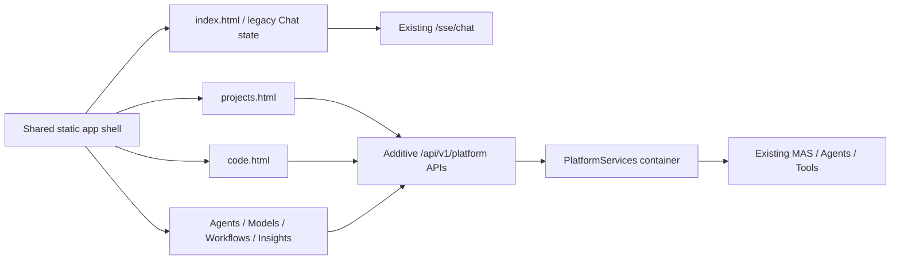

# Product UI and Code Workspace implementation plan

## 1. Repository facts that constrain the design

The current UI is a bundled static multi-page application under `oxygent/web/`.
There is no `package.json`, Vite/Webpack configuration, TypeScript, React, Vue,
frontend router, or frontend state library.

- `index.html` is the Chat application and contains about 4,000 lines of HTML
  and inline JavaScript.
- The UI uses native JavaScript, CSS, and jQuery 1.10.2 loaded from a CDN.
- `history.html`, `node.html`, and `prompts.html` are independent pages.
- Chat state is held in page globals such as `chats`, `branches`,
  `from_trace_id`, `plan_dict`, and the active `EventSource`.
- Chat sends a JSON payload through `GET /sse/chat?payload=...` and consumes
  `tool_call`, `observation`, `stream`, `organization_updated`, rerun, and SSE
  `close` events.
- `MAS.start_web_service()` creates FastAPI inline, includes additional
  `APIRouter` instances, and mounts the package directory at `/web`.
- There is no backend WebSocket endpoint. New product events should use SSE.
- Current browser tests cover APIs and static redirection, but there is no DOM
  regression suite for `index.html`.
- The phase-one platform stores Profiles, Artifacts, Usage, and Traces in
  process memory and exposes no product API yet. There is no Project or Code
  Workspace domain model.

These facts rule out a framework rewrite in the first product PRs. Replacing
`index.html` with a new SPA would combine migration risk with feature work and
would put existing streaming, attachments, rerun, trace graph, history, and
tool rendering at risk.

## 2. Frontend architecture decision

Continue with the existing static technology stack and evolve it into a shared
multi-page shell:

```text
oxygent/web/
├── index.html                 # Existing Chat; retained as the default route
├── projects.html
├── code.html
├── files.html
├── agents.html
├── models.html
├── workflows.html
├── insights.html
├── settings.html
├── css/
│   ├── app-shell.css
│   └── pages/*.css
└── js/
    ├── app-shell.js
    ├── api-client.js
    ├── platform-events.js
    └── pages/*.js
```

`app-shell.js` owns only navigation, capability detection, shared badges, and
page selection. It must not own or reset Chat state. `index.html` keeps its
existing message and SSE handlers; the shell is injected around the current
layout without renaming existing element IDs.

New pages use small page-local state objects under one namespace such as
`window.OxyGentApp`. They use ordinary links and page loads instead of adding a
client router. This keeps static packaging and `MAS.start_web_service()`
unchanged and avoids a Node build dependency.



## 3. Compatibility boundaries

The following contracts are frozen during the eight PR sequence:

- `/web/index.html` remains the default Chat entry.
- Existing `/chat`, `/sse/chat`, `/async/chat`, `/async/trace`, `/feedback`,
  upload, history, Prompt, Node, and Rating routes remain compatible.
- Existing `tool_call`, `observation`, `stream`, `stream_end`, and `close`
  handling remains in place.
- General Chat continues to target the current master Agent unless the user
  explicitly selects another configured mode.
- `MAS.start_web_service()` and its optional `routers` integration remain valid.
- Project/Code APIs are additive under `/api/v1/platform` and are mounted with
  an additional router. A legacy MAS without platform services still starts;
  product pages show a clear “not configured” state instead of breaking Chat.

Research, Data, and Code modes must resolve through configured mode/Workflow
IDs. The frontend must not guess Agent names such as `research_agent`.

## 4. Backend contracts required by the UI

### 4.1 Service container and APIs

Add a non-global `PlatformServices` container holding repositories, registries,
router, workflow, event, coding, verification, and approval services. Build an
`APIRouter` with an explicit dependency on this container and pass it through
the existing `start_web_service(routers=[...])` extension point.

Planned additive API groups:

```text
/api/v1/platform/capabilities
/api/v1/platform/projects
/api/v1/platform/projects/{projectId}/artifacts
/api/v1/platform/projects/{projectId}/tasks
/api/v1/platform/projects/{projectId}/tasks/from-chat
/api/v1/platform/agents
/api/v1/platform/providers
/api/v1/platform/models
/api/v1/platform/routing-policies
/api/v1/platform/usage
/api/v1/platform/runs/{runId}/events
/api/v1/platform/repositories
/api/v1/platform/code-tasks
/api/v1/platform/code-tasks/{taskId}/diff
/api/v1/platform/code-tasks/{taskId}/verification
/api/v1/platform/code-tasks/{taskId}/approval
```

All responses use the existing `WebResponse` envelope initially. API DTOs use
the phase-one camelCase aliases. Collection endpoints need deterministic sort,
filter, and pagination before the UI depends on them.

### 4.2 New domain records

The minimum new records are:

- `Project`: ID, name, description, status, repository refs, team refs, active
  task count, monthly cost, timestamps, and settings.
- `ProjectTask`: project/run/workflow refs, title, type, status, source Chat
  trace, attachment refs, source Artifact refs, and risk.
- `RepositoryProfile`: project, canonical repository root reference, default
  branch, allowed base branches, and enabled state.
- `CodeTask`: Project Task reference, base commit, task branch, worktree path
  reference, Change Contract, changed files, verification and approval state.
- `ChangeContract`: objective, acceptance criteria, allowed/forbidden paths,
  file/diff limits, dependency-change permission, verification profile, risk.
- `VerificationProfile`: named commands represented as argument arrays, timeout,
  working-directory policy, and permitted environment variable names.
- `ApprovalRecord`: requested action, actor, decision, reason, immutable audit
  timestamp, and approved content hash.

Project records are generic and must not contain demo-domain fields.

### 4.3 Unified product event

Add a versioned product event without changing the legacy SSE wire schema:

```python
class PlatformEvent(PlatformModel):
    schema_version: str = "1.0"
    event_id: str
    project_id: str
    task_id: str
    run_id: str
    agent_id: str
    role: str
    provider_id: str
    model_id: str
    phase: str
    event_type: str
    timestamp: datetime
    payload: dict[str, Any]
```

The Workflow Timeline subscribes to a new run-event SSE endpoint with replay by
event ID. An event projector maps existing Oxy lifecycle events and the new
ModelRouter traces into this envelope. The old Chat `message_handler()` is not
replaced.

Default UI statuses are a projection only: Analyzing, Planning, Implementing,
Testing, Reviewing, Awaiting approval, Completed, Blocked, and Failed. Full
model/tool events remain in an advanced Execution Drawer. Route reasons may be
shown; `think`, chain-of-thought, raw authorization headers, and credentials may
not enter product event payloads.

## 5. Coding safety design

### 5.1 Coding engine boundary

Define the engine before adding repository operations:

```python
class CodingEngine(Protocol):
    async def execute(self, request: CodingRunRequest) -> CodingRunResult:
        ...
```

`NativeCodingEngine` initially supports only repository metadata/read, bounded
file search, Git diff read, and registered verification commands. Business code
depends on this protocol, not Aider or OpenHands. Future adapters remain names
and protocol boundaries only; they are not dependencies in this sequence.

### 5.2 Repository and worktree isolation

- Repository roots must come from an administrator/project allow-list, never a
  free-form task path.
- Every Code Task records the resolved base commit and gets a server-generated,
  sanitized task branch and separate worktree under a configured workspace root.
- All paths are canonicalized and checked against the task worktree. Symlink
  escapes, `..`, absolute user paths, and access to the original worktree fail.
- Git is invoked with `asyncio.create_subprocess_exec()` and fixed argument
  arrays. No command uses `shell=True`.
- A repository/task lock prevents duplicate worktree creation and concurrent
  apply/discard races.
- Worktree creation, apply, export, and discard are audited. No PR in this
  sequence pushes a branch or changes a remote.

### 5.3 Scope Guard

`ScopeGuard` is called by every mutation boundary and again against the actual
Git diff before verification or approval. It rejects:

- files outside `allowedPaths` or matching `forbiddenPaths`;
- dependency manifests/lockfiles when dependency changes are disabled;
- too many changed files or diff lines;
- changes outside the task worktree;
- a diff whose base commit no longer matches the recorded contract.

The prompt may summarize the Change Contract, but the prompt is never the
enforcement mechanism.

### 5.4 Verification

Verification commands are project-owned records such as:

```json
{"name":"unit","argv":["python","-m","pytest","tests/unit","-q"]}
```

The runner uses `create_subprocess_exec(*argv, cwd=validated_worktree)`, a
sanitized environment allow-list, timeouts, output-size limits, and process-group
cancellation. It records the real exit code, duration, stdout/stderr artifact
references, and command definition hash. It never accepts a Shell command
string from a model or browser request.

## 6. Independent PR plan

### PR 1 — navigation and empty page skeletons

Scope:

- Add the shared left navigation for Chat, Projects, Code, Files, Agents,
  Models, Workflows, Insights, and Settings.
- Keep `index.html` as Chat and preserve every existing ID and event handler.
- Add empty static pages, shared shell styles, active-route behavior, responsive
  collapse, loading/empty/error components, and a capability banner.
- Add the Chat mode selector and Code quick-action visuals, but leave controls
  requiring repository/team data disabled with explicit text.

Tests and evidence:

- Static-file and root-redirect API tests;
- HTML contract test for navigation links and unchanged Chat IDs;
- manual legacy Chat streaming/attachment/rerun smoke test;
- screenshots of Chat with navigation and Projects/Code empty states.

Migration: none. No backend API, domain model, or SSE changes.

### PR 2 — Projects and Artifacts

Scope:

- Add generic Project and ProjectTask schemas, repository protocols, in-memory
  test stores, and a LocalEs-compatible persistence adapter.
- Add Project list/detail APIs and Overview, Ideas, Requirements, Architecture,
  Tasks, Code, Artifacts, Team, Activity, and Settings tabs.
- Expose existing versioned Artifacts by Project.
- Add “Convert to Project Task” to Chat using trace ID, attachment references,
  and selected Artifact IDs. Do not duplicate the full Chat transcript into the
  task record.
- Make the Files page a project attachment/Artifact reference browser; it is
  not a source-code editor.

Tests and evidence:

- Project CRUD/repository contract tests;
- Project isolation and Artifact revision tests;
- Chat conversion payload and attachment-reference tests;
- screenshots for list, detail, empty, and conversion states.

Migration: additive Project/Task/Artifact indexes; no old Trace migration.

### PR 3 — Agents and Models

Scope:

- Expose Role, AgentProfile, ProviderProfile, ModelProfile, ToolPolicy,
  RoleModelPolicy, Usage, and health APIs from the phase-one services.
- Build Agent Team and Models pages with Providers, Models, Routing Policies,
  and Usage tabs.
- Show the explicit Role → Provider/Model mapping, routing mode,
  capabilities, Tool policy, status, tokens, cost, and success rate.
- Compute display state as Fixed, Auto, or Fallback from policy and latest
  invocation; do not add model names to RoleDefinition.
- Provider Test Connection calls the registered adapter `health_check()`.
  Credential fields display only a mask/reference. Responses and logs never
  return the resolved secret.

Tests and evidence:

- API and UI serialization tests;
- provider disable/health and routing-policy validation tests;
- credential redaction tests covering errors and browser responses;
- screenshots showing PM → A, Architect → B, Lead → C, Reviewer → D and a
  fallback reason without private reasoning.

Migration: additive APIs around existing registries; legacy LLM config remains.

### PR 4 — Workflow Timeline

Scope:

- Add `PlatformEvent`, append-only event store, Oxy/ModelRouter event projector,
  and replayable run-event SSE endpoint.
- Add Workflows page and the center engineering timeline for Requirement,
  Architecture, Plan, Implementation, Verification, Review, and Approval.
- Show role, Provider, model, status, summary, tools, Artifact, cost, and
  duration. Put raw model/tool records in a collapsed Execution Drawer.
- The existing four-role Workflow reports only phases it actually executes;
  later Code phases appear as not started, never as fabricated success.

Tests and evidence:

- event schema/version/order/replay tests;
- legacy SSE contract regression tests;
- event redaction and status-projection tests;
- screenshot of running, failed, and awaiting-approval timelines.

Migration: new event stream only; old `/sse/chat` remains unchanged.

### PR 5 — Repository and Git Worktree

Scope:

- Add RepositoryProfile, CodeTask, ChangeContract, ScopeGuard, CodingEngine,
  and the read-only `NativeCodingEngine`.
- Add repository registration and safe metadata/tree/search APIs.
- Create one isolated Git worktree per Code Task and record base commit, task
  branch, worktree reference, changed files, and diff metadata.
- Build the Code Workspace left column and enable homepage Repository/Base
  branch/Agent team selection plus Code quick actions.
- Disable Code APIs unless the server is loopback-only or an authorization
  middleware is configured; current global unauthenticated routes are not a
  sufficient boundary for repository access.

Tests and evidence:

- temporary-repository worktree isolation tests;
- path traversal, symlink escape, branch validation, and Scope Guard tests;
- proof that the original working directory is unchanged;
- screenshots of repository context and Change Contract review.

Migration: new workspace root and repository metadata; no repository is scanned
or registered automatically.

### PR 6 — Diff and Verification

Scope:

- Add bounded diff APIs and the right-side Summary, Changes, Diff,
  Verification, Review, and Artifacts tabs.
- Start with a safe escaped unified-diff renderer. Monaco Diff can be added as a
  pinned, vendored enhancement without turning the UI into a VS Code clone.
- Add VerificationProfile and fixed-argv runner for format, lint, typecheck,
  compile, unit, integration, and build command slots.
- Display exact argv, real exit code, duration, truncated output, and complete
  output Artifact links. Re-run Scope Guard before command execution.

Tests and evidence:

- command-array validation and shell-metacharacter tests;
- timeout, cancellation, output-limit, cwd, and real-exit-code tests;
- diff escaping and changed-file-limit tests;
- screenshots of passing, failing, and blocked verification.

Migration: existing projects have no verification profile until configured.

### PR 7 — Approval and Apply/Discard

Scope:

- Add an audited approval state machine and immutable Approval records.
- Implement Request revision, Approve changes, Apply to branch, Export patch,
  and Discard as separate operations.
- Approve changes updates approval state only. It performs no Git mutation.
- The first Apply operation commits the approved content hash to the isolated
  task branch. It does not merge the base branch, touch the original worktree,
  push, or open a remote PR.
- Reject apply if the diff changed after approval, verification is stale,
  Scope Guard fails, or a high-risk task lacks human approval.
- Discard requires explicit confirmation and exports a recovery patch before
  worktree/branch cleanup.

Tests and evidence:

- state-transition and separation-of-actions tests;
- stale approval/hash, high-risk gate, apply, export, and discard tests;
- screenshots for revision, approval, apply confirmation, and recovery patch.

Migration: no automatic approval of existing tasks.

### PR 8 — Insights and cost statistics

Scope:

- Persist/query ModelUsage and aggregate by Project, role, Provider, model,
  Workflow, status, and time range.
- Add Insights dashboards for tokens, estimated cost, latency, success rate,
  fallback rate, and task outcomes.
- Link aggregates back to sanitized route decisions and execution runs.
- Add budget-warning states without automatically changing policies.

Tests and evidence:

- aggregation, time-boundary, project-isolation, and missing-price tests;
- no-secret/no-private-reasoning response tests;
- screenshots for populated and empty Insights states.

Migration: historical records without Project IDs remain “unassigned” and are
not silently attributed.

## 7. Cross-PR definition of done

Every PR must include:

1. focused Python/API tests and unchanged legacy Chat regression tests;
2. static-page contract tests and a manual browser smoke checklist;
3. screenshots or a precise UI-state description;
4. an additive migration note and rollback behavior;
5. no `.env`, resolved credential, token, authorization header, or repository
   content outside configured scope;
6. a startup check with a legacy MockLLM MAS and a platform-enabled demo;
7. no unrelated formatting or core-class rewrite.

## 8. Execution prerequisite

The current working tree contains uncommitted phase-one platform work together
with earlier local setup/LLM changes. PR 1 must not be layered onto that mixed
working tree if it is expected to be independently reviewable. Before coding
PR 1, establish a clean reviewed baseline by either committing the completed
phase-one scope separately or selecting the exact files that belong to that
baseline. No current user changes should be discarded or reset.
