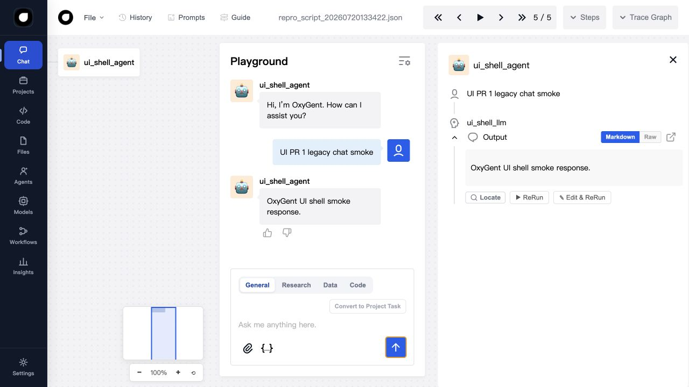
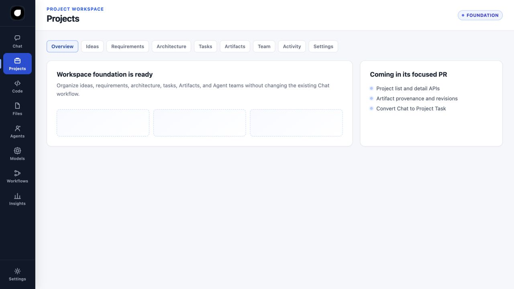
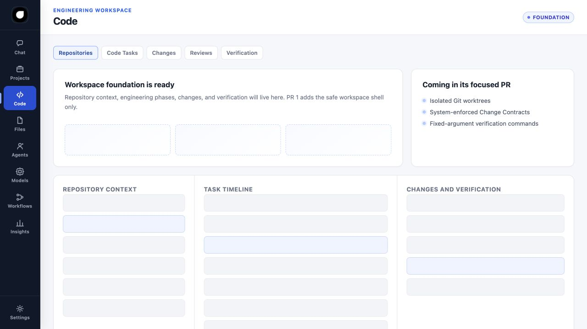

# PR 1: Product Navigation and Workspace Shell

## Scope

This PR adds the first additive product-interface layer on top of the existing
OxyGent Web UI. It introduces the final top-level information architecture and
static workspace entry points without changing the existing Chat transport,
agent runtime, tools, or storage behavior.

The new primary navigation is:

`Chat / Projects / Code / Files / Agents / Models / Workflows / Insights / Settings`

The existing `index.html` remains the Chat application and still owns the
current SSE conversation, trace, prompt, file, and agent interactions.

## Added routes

All routes continue to use the existing `/web` static mount:

| Area | Route | PR 1 state |
| --- | --- | --- |
| Chat | `/web/index.html` | Existing app plus mode entry points |
| Projects | `/web/projects.html` | Project section shell |
| Code | `/web/code.html` | Three-column workspace shell |
| Files | `/web/files.html` | Files shell |
| Agents | `/web/agents.html` | Agent team shell |
| Models | `/web/models.html` | Provider/model/policy shell |
| Workflows | `/web/workflows.html` | Workflow shell |
| Insights | `/web/insights.html` | Usage and cost shell |
| Settings | `/web/settings.html` | Settings shell |

The Code shell presents Repository Context, Task Timeline, and Changes and
Verification as separate columns. Repository execution and file mutation remain
disabled until the isolated worktree and scope-guard PRs.

## Chat compatibility

- Existing DOM IDs and `send_message()` remain available.
- The GET EventSource contract at `../sse/chat?payload=...` is unchanged.
- General, Research, Data, and Code are UI modes only in this PR.
- Code mode exposes repository/workflow/team placeholders and task shortcuts.
- `Convert to Project Task` is visible but disabled until the Project APIs land.
- The unload handler now safely tolerates an uninitialized WebSocket so that
  navigation away from Chat does not emit a console exception.

## Migration

There is no data or configuration migration. Existing bookmarks to
`/web/index.html` continue to work. The new pages are static additions served by
the same FastAPI `StaticFiles` mount, and they require no Node.js build step.

## Validation evidence

### Existing Chat with SSE response

### Projects shell

### Code Workspace shell

Automated coverage verifies that all routes are served by the existing static
mount, required navigation entries are present, legacy Chat IDs and SSE markers
remain intact, and the Project/Model/Code section labels are represented.
