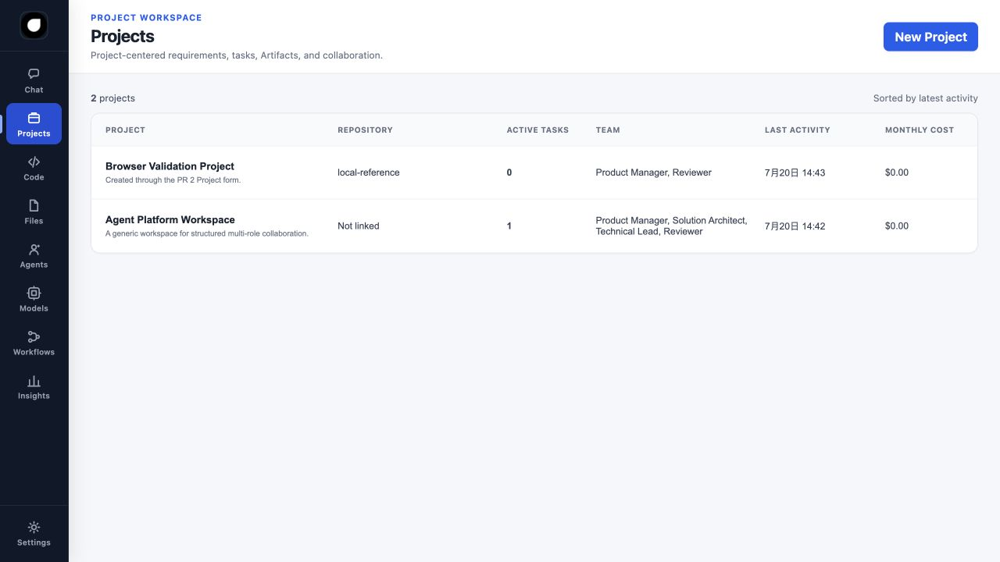
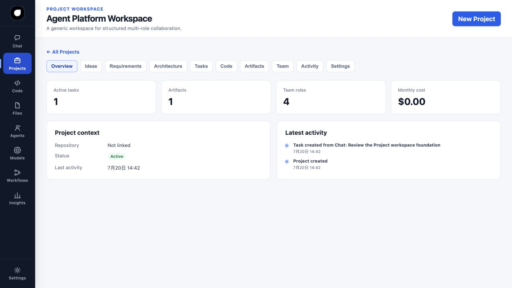
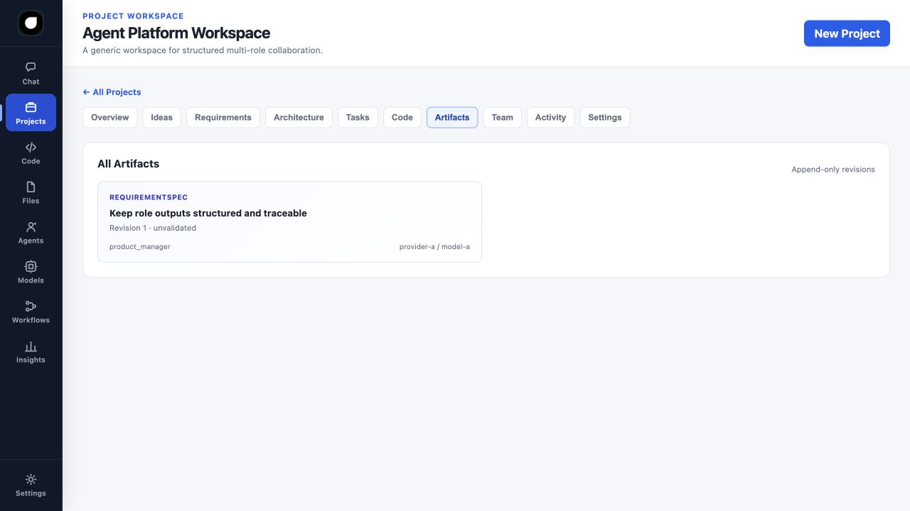
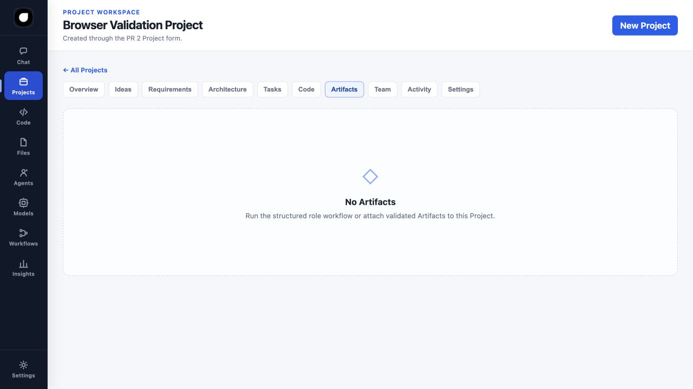
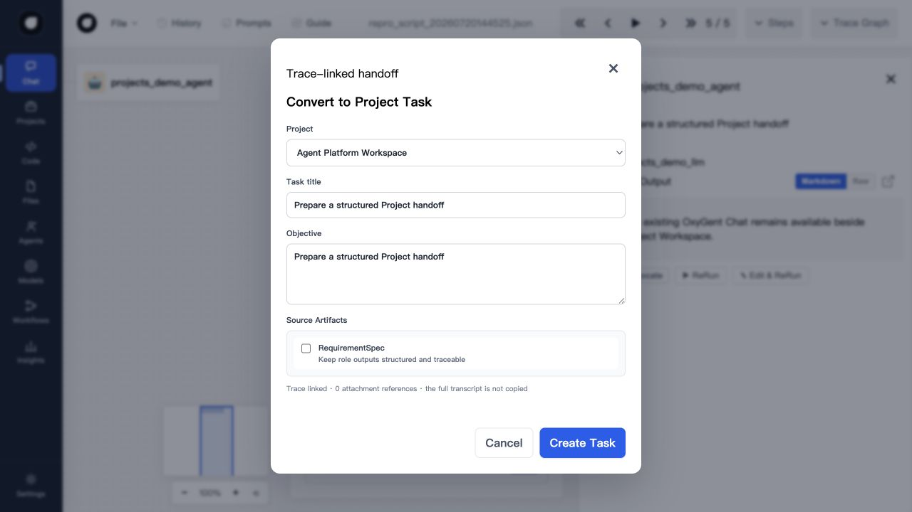

# PR 2: Projects and Artifacts

## Outcome

This PR adds the first working Project domain and connects it to the existing
append-only Artifact model. It remains additive: the legacy Chat endpoints,
SSE event handling, Agents, Tools, MCP, Files, traces, and MAS startup behavior
are unchanged.

## Backend modules

```text
oxygent/platform/
├── projects.py   # Project, ProjectTask, repository protocols and adapters
├── services.py   # Explicit PlatformServices application boundary
└── api.py        # /api/v1/platform Projects and Artifacts router
```

`PlatformServices` is caller-owned and is not a module global. A legacy MAS can
start without it. A platform-enabled MAS passes
`build_platform_router(services)` through the existing `routers` argument.

### Project records

`Project` stores generic metadata only: name, description, status, repository
reference, team roles, active task count, monthly cost, settings, and
timestamps. No demo-domain fields are part of the model.

`ProjectTask` stores a bounded objective and references to its source context:

- source trace ID;
- opaque attachment file-name references;
- source Artifact IDs;
- Project ID, task type, risk, and status.

The full Chat transcript is deliberately not copied into the task record.
Attachment references reject absolute paths, separators, and traversal.

### Persistence

In-process repositories are concurrency-safe and are the default for local
demos and tests. `LocalEsProjectRepository` and
`LocalEsProjectTaskRepository` adapt the current OxyGent LocalEs/ES-like
`index`, `search`, and `delete` methods without modifying LocalEs itself.

Persistent deployments can construct services as follows:

```python
from oxygent.databases.db_es import LocalEs
from oxygent.platform import (
    LocalEsProjectRepository,
    LocalEsProjectTaskRepository,
    PlatformServices,
)

backend = LocalEs()
services = PlatformServices(
    projects=LocalEsProjectRepository(backend),
    tasks=LocalEsProjectTaskRepository(backend),
)
```

The additive index names are `platform_projects` and
`platform_project_tasks`. Existing trace and prompt indexes require no
migration. Artifact persistence remains the next storage migration boundary;
the PR reuses the Phase 1 append-only in-memory Artifact store.

## API

The router exposes:

```text
GET    /api/v1/platform/capabilities
GET    /api/v1/platform/projects
POST   /api/v1/platform/projects
GET    /api/v1/platform/projects/{projectId}
PATCH  /api/v1/platform/projects/{projectId}
DELETE /api/v1/platform/projects/{projectId}
GET    /api/v1/platform/projects/{projectId}/tasks
POST   /api/v1/platform/projects/{projectId}/tasks/from-chat
GET    /api/v1/platform/projects/{projectId}/artifacts
GET    /api/v1/platform/projects/{projectId}/artifacts/{artifactId}
POST   /api/v1/platform/projects/{projectId}/artifacts/{artifactId}/revisions
GET    /api/v1/platform/projects/{projectId}/activity
```

Hard deletion is allowed only for empty Projects. Projects with Tasks or
Artifacts must be archived, preventing accidental loss of referenced records.
Artifact access and task source references are checked against the target
Project to prevent cross-Project leakage.

## UI behavior

Projects now supports:

- Project list with repository, active tasks, team, last activity, and cost;
- Project creation;
- Project detail tabs and URL-addressable state;
- Overview metrics, Tasks, Artifacts, Team, Activity, and Settings;
- Requirement and Architecture views filtered from typed Artifacts;
- explicit empty and API-not-configured states.

Chat enables `Convert to Project Task` after Projects are discovered. The modal
selects a Project and optional latest Artifacts, then submits the current trace,
known attachment references, title, and bounded objective. It shows a success
link to the new Task. The Files page presents Project attachment references and
Artifacts without becoming a source-code editor.

## Run locally

From the repository root:

```bash
PYTHONPATH=. .conda-env/bin/python examples/platform/projects_web_demo.py
```

Then open:

```text
http://127.0.0.1:18080/web/projects.html
```

Set `OXYGENT_PROJECT_DEMO_PORT` to use another port. The demo uses `MockLLM`,
requires no API key, and places all sample data in `examples/`.

## UI evidence

### Project list



### Project overview



### Artifact provenance



### Empty state



### Chat conversion



## Rollback

Remove the additional router from `start_web_service(routers=[...])` and the
legacy application continues to start. The static pages show a clear
not-configured state when the router is absent. No existing data transformation
or rollback migration is required.
